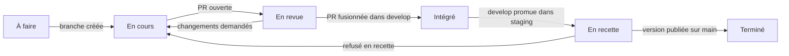
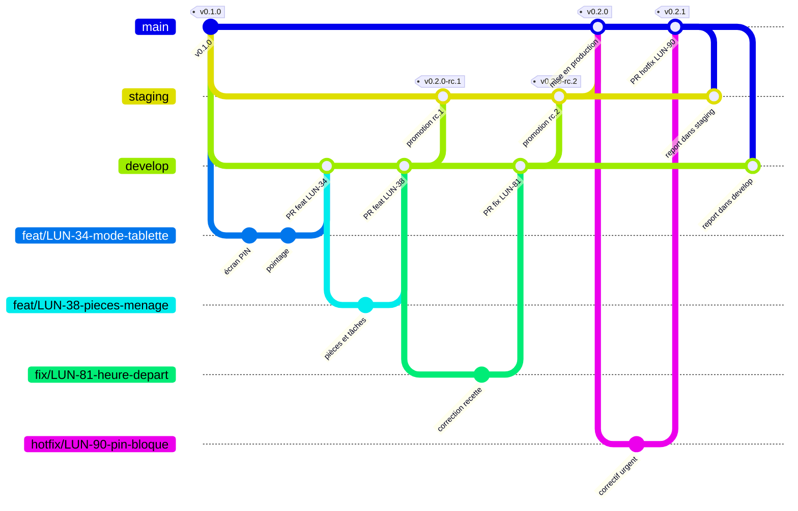
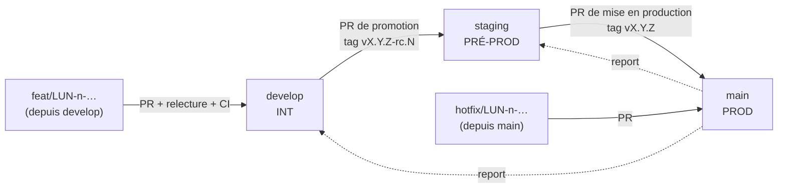

# Contribuer à Luniqo

Règles de travail de l'équipe : tickets, branches, versions, pull requests.
Elles ont été décidées en groupe le 2026-10-09 (cours « Coordination Front &
Back ») à partir d'un premier brouillon de stratégie de branches rédigé par
l'équipe. Installation du projet : [README.md](README.md).

## En bref

1. Prendre un ticket `LUN-<n>` dans le sprint Jira.
2. Créer sa branche depuis `develop` : `feat/LUN-<n>-description-courte`.
3. Ouvrir une PR vers `develop`, avec la clé `LUN-<n>` dans le titre.
4. Une fois relue et la CI verte, la PR est fusionnée : la fonctionnalité est **intégrée**.
5. `develop` est promue en recette (`staging`), puis en production (`main`) avec un tag de version.

## 1. Tickets (Jira, projet LUN)

### Hiérarchie

```
Epic        une grande fonctionnalité (« Pointage sur tablette »)
└── Story   un besoin utilisateur livrable (« Mode tablette : pointer une arrivée »), estimé en points
    └── Sous-tâche  le travail d'une personne, côté [Front], [Back], [Infra] ou [Doc]
```

Les tâches techniques sans valeur directe pour l'utilisateur (CI, documentation)
sont des **Task**, rattachées à un épic comme les stories.

### Champs utilisés pour trier et retrouver

| Champ | Valeurs | Sert à |
|---|---|---|
| Composant | `Front`, `Back`, `Infra`, `Doc` | savoir qui peut prendre le ticket, filtrer le board |
| Étiquettes | `securite`, `rgpd`, `tablette`, `bc01`…`bc04` (blocs du diplôme), `cours-docker`, `cours-coordination` | regrouper par thème |
| Story Points | suite de Fibonacci 1, 2, 3, 5, 8, 13 | estimer en planning poker, suivre la vélocité |
| Priorité | Highest à Lowest | ordonner le backlog |
| Fix versions | `v0.1.0`, `v0.2.0`… | savoir dans quelle version un ticket sort |

### Cycle de vie d'un ticket



| Statut | Signifie | Qui le fait passer | Comment |
|---|---|---|---|
| À faire | prêt, dans le sprint | — | sprint planning |
| En cours | quelqu'un travaille dessus | automatique | Jira : une branche contenant la clé est créée |
| En revue | PR ouverte | automatique | Jira : une PR contenant la clé est ouverte |
| Intégré | fusionné dans `develop` | automatique | Jira : PR fusionnée ; la version suivante est posée dans « Fix versions » |
| En recette | testé en PRÉ-PROD | chef de projet | lors de la PR de promotion `develop` → `staging` |
| Terminé | en production | automatique | Jira : la version est publiée (« Release ») |

Les règles d'automatisation sont décrites dans [docs/projet/JIRA.md](docs/projet/JIRA.md).

## 2. Branches

### Branches durables

| Branche | Environnement | Rôle | Reçoit | Protection |
|---|---|---|---|---|
| `develop` | INT (intégration) | ce qui est fini, relu et testé | PR de ticket, report de `main` | PR obligatoire, 1 relecture, CI verte |
| `staging` | PRÉ-PROD (recette) | version candidate en test métier | promotion de `develop`, report de `main` | PR obligatoire, CI verte, validation du chef de projet |
| `main` | PROD | ce qui est en production, tagué | promotion de `staging`, `hotfix/…` | PR obligatoire, 2 relectures, CI verte, tag de version |

**Les environnements aujourd'hui.** INT existe : à chaque push sur `develop` (et
sur chaque PR), la CI construit les 5 images, démarre toute la pile et la sonde.
PRÉ-PROD et PROD sont **des cibles** : elles seront déployées sur un VPS (story
« Environnements PRÉ-PROD et PROD » de l'épic « Socle technique et
livraison »). D'ici là, `staging` et `main` sont vérifiées par la même CI.

### Branches de travail

| Préfixe | Pour | Part de | Fusionne dans |
|---|---|---|---|
| `feat/` | une fonctionnalité | `develop` | `develop` |
| `fix/` | un défaut trouvé avant la production | `develop` | `develop` |
| `docs/`, `infra/`, `chore/` | documentation, CI et conteneurs, maintenance | `develop` | `develop` |
| `hotfix/` | un défaut **en production** | `main` | `main`, puis report |

Nom : `<préfixe>/LUN-<n>-<description-en-minuscules-avec-tirets>`, par exemple
`feat/LUN-34-mode-tablette`. La clé `LUN-<n>` s'écrit comme dans Jira, **sans
zéro devant** (`LUN-6`, pas `LUN-006`) : c'est elle qui relie la branche, ses
commits et sa PR au ticket. Une branche de travail est supprimée après sa fusion.

### Seul ce qui est fini entre dans `develop`

Une PR n'est fusionnée dans `develop` que si elle respecte la
[Definition of Done](#5-definition-of-done). Une fonctionnalité inachevée reste
sur sa branche. Si elle doit être fusionnée par morceaux, la partie visible est
cachée derrière un drapeau de configuration jusqu'à ce qu'elle soit complète.
Ainsi, `develop` peut être promue à tout moment.

### Promotion et recette

Le circuit complet, d'une version à la suivante : deux fonctionnalités
intégrées, une première version candidate refusée en recette, corrigée sur
`develop` puis promue à nouveau, la mise en production, puis un correctif
urgent et son report.





1. **Promotion en recette.** Le chef de projet ouvre une PR `develop` → `staging`
   (titre : `Promotion v0.2.0-rc.1`). Toute `develop` part : c'est la version
   candidate, taguée `v0.2.0-rc.1` après la fusion. Les tickets passent « En recette ».
2. **Recette réussie.** PR `staging` → `main`, puis tag `v0.2.0` et publication
   de la version dans Jira. Les tickets passent « Terminé ».
3. **Recette refusée.** On ne corrige jamais directement `staging`. Le correctif
   suit le chemin normal (`fix/LUN-n-…` → `develop`), puis on promeut une
   nouvelle candidate `v0.2.0-rc.2`. Si une fonctionnalité n'est pas prête du
   tout, son commit de fusion est annulé sur `develop` (`git revert`) avant la
   nouvelle promotion.

### Correctif urgent en production

1. Branche `hotfix/LUN-n-…` depuis `main`, PR vers `main` (2 relectures, CI verte).
2. Tag de version corrective (`v0.2.1`) après la fusion.
3. Report immédiat par PR : `main` → `staging`, puis `main` → `develop`. Sans ce
   report, le correctif disparaîtrait à la prochaine promotion.

### Ce que vérifie GitHub à chaque PR

Le workflow [Conventions de PR](.github/workflows/pr-conventions.yml) refuse :
une branche mal nommée, une cible interdite (par exemple `feat/…` → `main`) et,
pour une PR de ticket, un titre sans clé `LUN-<n>`. Le workflow
[Étiquettes de PR](.github/workflows/labels.yml) pose `front`, `back`, `infra` ou
`doc` selon les fichiers modifiés : on voit d'un coup d'œil qui doit relire.

## 3. Versions (SemVer)

Une seule version pour tout le dépôt, au format `MAJEUR.MINEUR.CORRECTIF`
([Semantic Versioning 2.0.0](https://semver.org/lang/fr/)), portée par un tag git
`vX.Y.Z` sur `main`.

| On incrémente | Quand | Exemple |
|---|---|---|
| **MAJEUR** | changement incompatible pour les utilisateurs de l'API (route retirée, champ renommé) | `1.4.2` → `2.0.0` |
| **MINEUR** | nouvelle fonctionnalité compatible | `1.4.2` → `1.5.0` |
| **CORRECTIF** | correction sans nouvelle fonctionnalité | `1.4.2` → `1.4.3` |

- **Avant la 1.0.0**, l'API n'est pas stable : un changement incompatible
  n'incrémente que le MINEUR (`0.3.0` → `0.4.0`). La `1.0.0` sera la première
  version en production chez une crèche.
- **Versions candidates** : `vX.Y.Z-rc.N` sur `staging`, `N` repart à 1 pour
  chaque nouvelle version.
- La version de l'API (`api/app/__init__.py`) et celle du front (`package.json`)
  suivent celle du dépôt. Les images Docker seront taguées avec elle (phase de
  déploiement continu).
- Chaque version a son entrée dans [CHANGELOG.md](CHANGELOG.md).

### Préparer une version

1. PR `chore/LUN-n-version-X-Y-Z` vers `develop` : section « Non publié » du
   CHANGELOG renommée en `[X.Y.Z]` et datée, numéros de version mis à jour.
2. Promotion `develop` → `staging`, tag `vX.Y.Z-rc.1`.
3. Mise en production `staging` → `main`, tag `vX.Y.Z`, version publiée dans Jira.

## 4. Commits et pull requests

**Commits** : [Conventional Commits](https://www.conventionalcommits.org/fr/v1.0.0/),
en français, avec la clé du ticket :

```
feat(api): pointage groupé pour une fratrie (LUN-34)
fix(tablette): heure de départ en heure de Paris (LUN-81)
docs: stratégie de branches (LUN-22)
```

Types : `feat`, `fix`, `docs`, `refactor`, `test`, `chore`, `ci`. Portée
facultative : `api`, `front`, `tablette`, `docker`…

**Pull requests** : le [modèle](.github/pull_request_template.md) est rempli
automatiquement. Titre au format d'un commit, avec la clé. Une PR = un ticket.
On ne fait jamais partir une branche d'une autre branche de travail (PR
empilées) : toujours de `develop`.

**Relecture** : au moins une personne pour `develop`, deux pour `main`. Une
modification du front est relue de préférence par Pauline ou Thomas, une du
back par Julien ou Thomas.

## 5. Definition of Done

Un ticket est fini, et sa PR peut entrer dans `develop`, quand :

- [ ] le code est relu et approuvé ;
- [ ] les tests passent (`cd api && pytest`, avec la base de test pour l'intégration) et couvrent la nouvelle règle ;
- [ ] la CI est verte (lint, tests, images, démarrage de la pile) ;
- [ ] le parcours touché a été rejoué sur la pile Docker ;
- [ ] la documentation est à jour (README, ce fichier, registre des choix techniques si un choix a été fait) ;
- [ ] une ligne est ajoutée dans `CHANGELOG.md`, section « Non publié ».

## 6. Règles propres au projet

- **v1 gelée** : la racine du dépôt (Next.js + Supabase) ne reçoit que des correctifs de sécurité.
- **Données synthétiques uniquement** : jamais de données réelles d'enfants, de familles ou de salariés (dépôt public).
- **Aucun secret dans le dépôt** : mots de passe et clés dans des fichiers `.env` non versionnés ou des secrets Docker. Les fichiers `docker/secrets/*.dev` sont des valeurs de développement.
- **Isolation des données** : toute route d'une crèche passe par les dépendances d'accès de l'API (`ReadableNursery`, `ManagedNursery`).
- Le détail technique (architecture, conventions de code) est dans [CLAUDE.md](CLAUDE.md) et [api/README.md](api/README.md).
