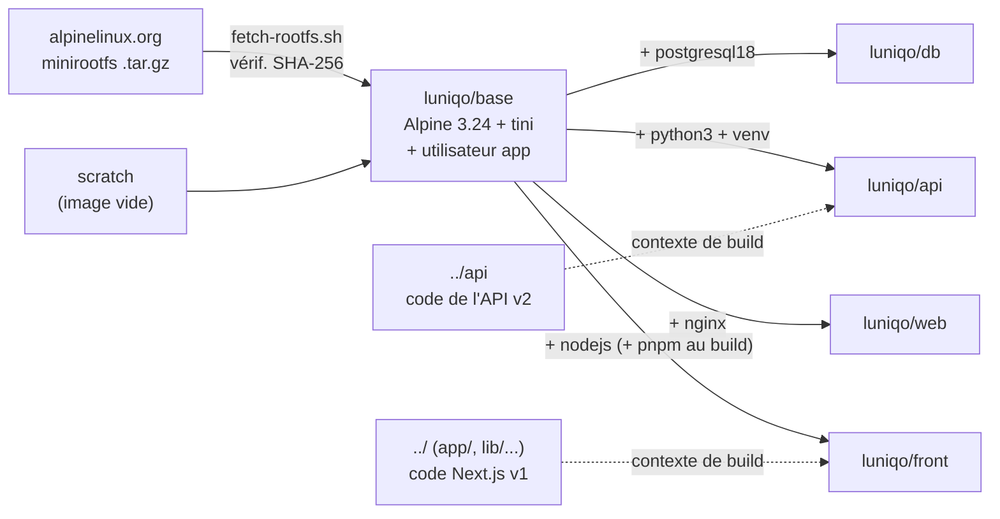
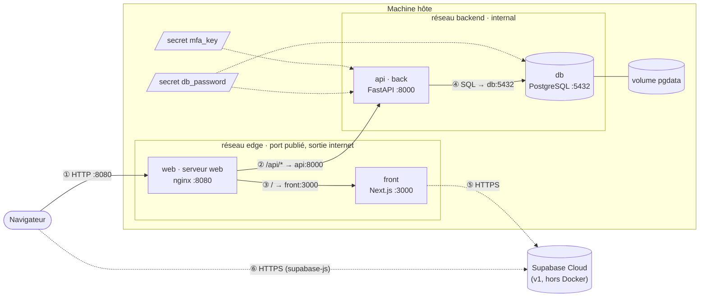
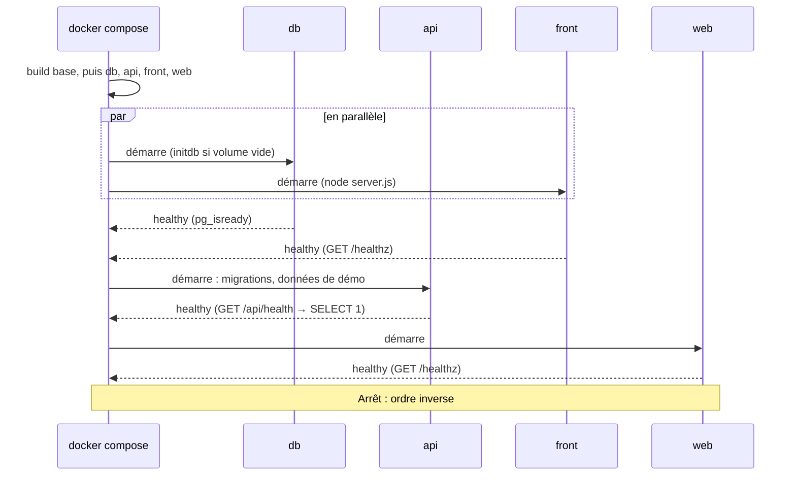

# TP Docker : Luniqo dans mon propre cloud, sans Docker Hub

[Luniqo](../README.md) est un logiciel de gestion de crèches. Ce TP, rangé
dans `docker/` du dépôt [Luniqo](https://github.com/zharrow/Luniqo),
le fait tourner dans une architecture de conteneurs orchestrés
avec docker compose : une **passerelle web** (nginx), une **API** (FastAPI), une
**base de données** (PostgreSQL) et le **front** (l'application Next.js). Toutes
les images sont construites à partir de rien (`FROM scratch`) : **aucune image
ne vient de Docker Hub**.

| Exigence du sujet | Réponse |
|---|---|
| 0 image Docker Hub, images personnalisées | 5 images construites depuis `scratch` ([détail](#zéro-image-docker-hub)) |
| Au moins un front, un back, un serveur web | `front` (Next.js), `api` (FastAPI), `web` (nginx), plus `db` (PostgreSQL) |
| Arguments de ressources au run et dans le compose | `.env` → `docker-compose.yml` → limites cgroups + arguments applicatifs ([détail](#orchestration)) |

## Sommaire

1. [Démarrage rapide](#démarrage-rapide)
2. [Architecture](#architecture)
3. [Zéro image Docker Hub](#zéro-image-docker-hub)
4. [Les images](#les-images)
5. [Orchestration](#orchestration)
6. [Docker face à la virtualisation classique](#docker-face-à-la-virtualisation-classique)
7. [Correspondance avec le barème](#correspondance-avec-le-barème)

## Démarrage rapide

Prérequis : Docker récent avec le plugin compose (Docker Desktop, OrbStack ou
Docker Engine), machine amd64 ou arm64, accès à internet pour le build (dépôts
Alpine, PyPI, npm et Google Fonts). Testé avec Docker 29. Premier build sans
cache : 60 s mesurées pour les 5 images (sur un Mac Apple Silicon).

```sh
git clone https://github.com/zharrow/Luniqo.git && cd Luniqo/docker
docker compose up -d --build     # construit les images puis lance les services
docker compose ps                # db, api, front et web doivent être "healthy"
```

| Pour... | Faire |
|---|---|
| Ouvrir Luniqo | <http://localhost:8080> (page de connexion) |
| Voir l'état de l'API | <http://localhost:8080/api/health> |
| Se connecter et lister les crèches (données de démo) | Swagger : `POST /api/v2/auth/login` puis `GET /api/v2/nurseries` (comptes créés si `API_SEED_DEMO_PASSWORD` est défini dans `../.env`) |
| Documentation de l'API (Swagger) | <http://localhost:8080/api/docs> |
| Lire les logs | `docker compose logs -f` |
| Changer les ressources | modifier `.env` puis `docker compose up -d` |
| Tout arrêter | `docker compose down` (ajouter `-v` pour effacer la base) |

Port 8080 déjà pris sur la machine : `WEB_PUBLISHED_PORT=8081 docker compose up -d`.

Le front utilise encore Supabase Cloud pour la connexion (v1 de Luniqo). Il lit
l'URL et la clé publique du projet dans le `.env` de l'application, à la racine
du dépôt (non versionné) :

```sh
# ../.env (racine du dépôt)
NEXT_PUBLIC_SUPABASE_URL=https://xxx.supabase.co
NEXT_PUBLIC_SUPABASE_ANON_KEY=...
```

On lance alors compose avec ce fichier en plus du sien :

```sh
docker compose --env-file .env --env-file ../.env up -d --build
```

Sans ce fichier, `docker compose up -d --build` fonctionne aussi : toutes les
pages s'affichent, mais la connexion échoue (adresse Supabase factice).

## Architecture

### Arborescence

```
.
├── docker-compose.yml     orchestration des services
├── .env                   arguments de ressources de chaque conteneur
├── secrets/
│   ├── db_password.dev    mot de passe de développement de la base (secret Docker)
│   └── mfa_key.dev        clé de développement qui chiffre les secrets TOTP (secret Docker)
├── base/                  image de base : Alpine depuis scratch + tini + utilisateur app
├── db/                    PostgreSQL 18
├── api/                   image de l'API FastAPI (le code est dans ../api)
├── front/                 image du front Next.js (le code est à la racine du dépôt)
└── web/                   passerelle nginx, seul point d'entrée
```

Chaque dossier d'image contient un `README.md` qui détaille ses dépendances,
ses manipulations sur l'OS, ses arguments, son entrypoint, sa gestion des
signaux et son healthcheck.

### Construction des images



| Image | Taille | Contenu ajouté |
|---|---|---|
| `luniqo/base:1.0` | 23 Mo | Alpine (BusyBox, apk), tini, utilisateur `app`, outils `tp-resources` et `common.sh` |
| `luniqo/db:1.0` | 83 Mo | PostgreSQL 18.6 |
| `luniqo/api:0.1` | 186 Mo | Python 3.14, FastAPI, SQLAlchemy, psycopg, Alembic, le code de l'API |
| `luniqo/web:1.0` | 26 Mo | nginx 1.30, modèle de configuration, page d'indisponibilité |
| `luniqo/front:1.0` | 302 Mo | Node.js 24, serveur autonome Next.js, fichiers statiques |

### Schéma des communications



| # | De | Vers | Protocole | Réseau | Rôle |
|---|---|---|---|---|---|
| ① | navigateur | web `:8080` | HTTP | hôte → `edge` | seul point d'entrée |
| ② | web | api `:8000` | HTTP | `backend` | nginx relaie `/api/*` |
| ③ | web | front `:3000` | HTTP | `edge` | nginx relaie tout le reste (pages, fichiers statiques) |
| ④ | api | db `:5432` | PostgreSQL | `backend` | requêtes SQL, migrations au démarrage |
| ⑤ | front | Supabase Cloud | HTTPS | `edge` → internet | session et données de la v1, côté serveur |
| ⑥ | navigateur | Supabase Cloud | HTTPS | hors Docker | la v1 interroge aussi Supabase depuis le navigateur |

Les conteneurs se trouvent par leur **nom de service** grâce au DNS interne de
Docker : aucune adresse IP n'est écrite en dur.

### Réseaux

| Réseau | Type | Membres | Pourquoi |
|---|---|---|---|
| `edge` | bridge | web, front | Réseau d'où part le port publié sur l'hôte (par web seulement), avec sortie vers internet : le serveur Next.js appelle Supabase Cloud. Le front ne publie aucun port. |
| `backend` | bridge, `internal: true` | web, api, db | Communications internes. `internal` coupe toute sortie vers l'extérieur : l'API et la base sont **injoignables depuis l'hôte et sans accès à internet**. |

Vérifié :

```
$ curl localhost:8000          # API, depuis l'hôte
curl: (7) Failed to connect to localhost port 8000 after 0 ms: Couldn't connect to server
$ curl localhost:5432          # base, depuis l'hôte
curl: (7) Failed to connect to localhost port 5432 after 0 ms: Couldn't connect to server
$ docker compose exec api python -c "import urllib.request; urllib.request.urlopen('http://example.com')"
urllib.error.URLError: <urlopen error [Errno -3] Try again>
```

## Zéro image Docker Hub

| Endroit où Docker Hub pourrait intervenir | Ce qu'on fait à la place |
|---|---|
| `FROM alpine` / `FROM python` / `FROM postgres` / `FROM nginx` | `FROM scratch` + l'archive minirootfs téléchargée depuis le site d'Alpine (`base/`). Les autres images partent de `luniqo/base`. |
| `# syntax=docker/dockerfile:1` en tête de Dockerfile | Absente : elle téléchargerait le frontend de build depuis Docker Hub. |
| `image: postgres` dans le compose | Chaque service a une section `build:` et `pull_policy: build` : compose construit toujours et ne tente jamais de pull. |
| `FROM luniqo/base:1.0` avant que l'image existe | `additional_contexts: luniqo/base:1.0: service:base` : compose construit d'abord `base` et la fournit directement aux autres builds. |

Téléchargements faits pendant le build, aucun n'étant une image : paquets
Alpine (`apk`), paquets Python (PyPI), paquets JavaScript (npm) et polices
Google (`next/font`, au build Next.js).

Vérifiable : `grep FROM */Dockerfile` ne montre que `scratch`, une étape interne
(`rootfs-${TARGETARCH}`, `build`) ou `luniqo/base:1.0`, et
`docker compose config --images` ne liste que nos 5 images `luniqo/*`.

## Les images

| Image | Rôle | Dépendances | Port | Arguments de l'application | Signal d'arrêt |
|---|---|---|---|---|---|
| [base](base/README.md) | socle commun | `tini` | | (build) `ALPINE_VERSION` | |
| [web](web/README.md) | **serveur web** : passerelle | `nginx` | 8080 | `NGINX_WORKER_PROCESSES`, `NGINX_WORKER_CONNECTIONS`, `FRONT_ADDR`, `API_ADDR` | `SIGQUIT` |
| [api](api/README.md) | **back** : API | `python3` + venv | 8000 | `API_WORKERS`, `DB_POOL_SIZE`, `DB_ADDR`, `DB_NAME`, `DB_USER`, `DB_PASSWORD_FILE`, `SEED_DEMO` | `SIGTERM` |
| [db](db/README.md) | base de données | `postgresql18` | 5432 | `DB_NAME`, `DB_USER`, `DB_PASSWORD_FILE`, `DB_MAX_CONNECTIONS`, `DB_SHARED_BUFFERS` | `SIGINT` |
| [front](front/README.md) | **front** : application | `nodejs` (+ `pnpm` au build) | 3000 | `NODE_HEAP_MB`, `PORT` ; au build `NEXT_PUBLIC_SUPABASE_*` | `SIGTERM` |

Choix communs :

- **Utilisateur non-root** (`app`, uid 10001) pour tous les services.
- **Entrypoint en trois temps** : `tini` (PID 1, relaie les signaux) →
  `entrypoint.sh` (vérifie les arguments, affiche les ressources, prépare) →
  `exec` du programme, qui reçoit directement les signaux.
- **Arguments vérifiés** : une valeur invalide arrête le conteneur avec un
  message clair (code 64) plutôt que de le laisser tourner mal configuré.
- **Healthcheck qui teste vraiment le service** (requête HTTP, `pg_isready`,
  `SELECT 1`), utilisé par compose pour l'ordre de démarrage.

## Orchestration

### Les arguments traduits dans le compose

Tous les réglages sont dans [`.env`](.env), lu automatiquement par compose.
`docker-compose.yml` les injecte avec `${VARIABLE:-défaut}` : il reste
utilisable sans `.env`.

| `.env` | Dans `docker-compose.yml` | Équivalent `docker run` |
|---|---|---|
| `DB_CPUS=1.0` / `DB_MEMORY=256M` / `DB_PIDS=48` | `deploy.resources.limits` | `--cpus 1.0 --memory 256m --pids-limit 48` |
| `DB_MAX_CONNECTIONS=20` | `environment: DB_MAX_CONNECTIONS` | `-e DB_MAX_CONNECTIONS=20` |
| `DB_SHARED_BUFFERS=64MB` | `environment: DB_SHARED_BUFFERS` | `-e DB_SHARED_BUFFERS=64MB` |
| `DB_PASSWORD_FILE` (optionnel) | `secrets: db_password: file:` | `-v fichier:/run/secrets/db_password:ro` |
| `MFA_KEY_FILE` (optionnel) | `secrets: mfa_key: file:` | `-v fichier:/run/secrets/mfa_key:ro` |
| `API_CPUS=0.5` / `API_MEMORY=128M` / `API_PIDS=32` | `deploy.resources.limits` | `--cpus 0.5 --memory 128m --pids-limit 32` |
| `API_WORKERS=1` | `environment: API_WORKERS` | `-e API_WORKERS=1` |
| `API_DB_POOL_SIZE=8` | `environment: DB_POOL_SIZE` | `-e DB_POOL_SIZE=8` |
| `API_SEED_DEMO=true` | `environment: SEED_DEMO` | `-e SEED_DEMO=true` |
| `FRONT_CPUS=1.0` / `FRONT_MEMORY=384M` / `FRONT_PIDS=48` | `deploy.resources.limits` | `--cpus 1.0 --memory 384m --pids-limit 48` |
| `FRONT_NODE_HEAP_MB=192` | `environment: NODE_HEAP_MB` | `-e NODE_HEAP_MB=192` |
| `NEXT_PUBLIC_SUPABASE_URL`, `NEXT_PUBLIC_SUPABASE_ANON_KEY` (`../.env`, via `--env-file`) | `build.args` | `docker build --build-arg NEXT_PUBLIC_SUPABASE_URL=...` |
| `WEB_CPUS=0.25` / `WEB_MEMORY=32M` / `WEB_PIDS=16` | `deploy.resources.limits` | `--cpus 0.25 --memory 32m --pids-limit 16` |
| `WEB_WORKER_PROCESSES=1` / `WEB_WORKER_CONNECTIONS=512` | `environment: NGINX_WORKER_*` | `-e NGINX_WORKER_PROCESSES=1 ...` |
| `WEB_PUBLISHED_PORT=8080` | `ports: "8080:8080"` | `-p 8080:8080` |

Les adresses entre services (`API_ADDR=api:8000`, `DB_ADDR=db:5432`...) sont
écrites dans le compose : elles découlent des noms de services.

### Les limitations de ressources, conteneur par conteneur

Trois limites appliquées par le noyau via les **cgroups** : `cpus` (temps CPU,
le conteneur est ralenti au-delà), `memory` (au-delà, le noyau tue le processus
et `restart: unless-stopped` le relance), `pids` (processus **et threads** :
protège contre un emballement).

Mesures du 2026-10-08 (`docker stats`, Mac Apple Silicon sous OrbStack) :

| Service | CPU | Mémoire | PIDs | Au repos | Sous charge | Justification |
|---|---|---|---|---|---|---|
| db | 1.0 | 256 Mo | 48 | 20 à 45 Mo, 11 pids | 32 Mo, 18 pids, 12 % CPU | Les requêtes SQL sont le travail le plus coûteux. `shared_buffers` = 25 % de la mémoire. Un processus par connexion : `pids` couvre `max_connections` (20) + processus de fond. |
| api | 0.5 | 128 Mo | 32 | 69 Mo, 3 pids | 73 Mo, 6 pids, 49 % CPU | Un worker pour un demi-cœur. Routes asynchrones : aucune création de thread par requête. |
| front | 1.0 | 384 Mo | 48 | 72 à 122 Mo, 12 pids | 151 Mo, 12 pids, 102 % CPU | Le rendu des pages côté serveur est le plus coûteux en CPU. Tas JavaScript plafonné à 192 Mo, plus le tmpfs de 64 Mo du cache Next.js. |
| web | 0.25 | 32 Mo | 16 | 3 à 5 Mo, 3 pids | 4 à 6 Mo, 3 pids, 6 % CPU | nginx ne fait que relayer. |

Charges : 3 000 requêtes `/api/v2/nurseries` (route alors ouverte ; protégée par session depuis LUN-004) à 60 simultanées (db, api, web) ;
1 000 rendus de `/login` à 30 simultanés (front, web).

Total : 2,75 cœurs et 800 Mo au maximum, pour une consommation réelle au repos
d'environ 200 Mo.

Débits mesurés, sans aucune erreur : 3 000 requêtes d'API en 8,8 s (environ 340
par seconde) ; 1 000 pages en 5,7 s (environ 175 par seconde). Dans les deux cas,
le service sollicité plafonne **exactement à sa limite CPU** (api 49 % pour
0,5 cœur, front 102 % pour 1 cœur) : les limites jouent leur rôle. L'API plafonne alors à 49 % de CPU, c'est-à-dire **exactement sa limite de
0,5 cœur** : c'est elle le goulot, pas la base (12 %). Pour monter en charge, on
augmente ensemble `API_CPUS` et `API_WORKERS` (un worker par demi-cœur à un
cœur), puis `API_DB_POOL_SIZE` et `DB_MAX_CONNECTIONS` en conséquence.

**Les arguments de l'application suivent les limites Docker.** Une limite seule
ne suffit pas : un programme qui ne la connaît pas se comporte comme s'il avait
toute la machine. PostgreSQL ouvrirait 100 connexions (100 processus) et
réserverait 128 Mo de cache ; nginx en `auto` lancerait un worker par cœur de
l'hôte ; FastAPI ouvre par défaut un pool de 40 threads ; Node.js dimensionne
son tas selon la mémoire qu'il croit disponible. Les tests de charge
l'ont montré concrètement : avec la limite `pids` à 32, la première version de
l'API renvoyait **2 697 erreurs sur 3 000 requêtes** (`can't start new thread`).
La version asynchrone les sert toutes (détail dans [api/README.md](api/README.md#ce-que-les-mesures-ont-fait-changer)).

**Le mot de passe de la base est un secret, pas une variable.** Il est monté en
fichier dans `/run/secrets/db_password` et n'apparaît ni dans `docker inspect`
ni dans l'environnement des processus. Compose refuse un secret issu d'une
variable d'environnement sur un conteneur en lecture seule (`file is the sole
supported option`), d'où le fichier `secrets/db_password.dev`. C'est une valeur
de développement, versionnée pour que le projet démarre tel quel. Hors TP,
`DB_PASSWORD_FILE` pointe vers un fichier hors du dépôt. La clé qui chiffre les
secrets TOTP (`secrets/mfa_key.dev`, LUN-006) suit le même principe, avec
`MFA_KEY_FILE`.

### Gestion de SIGTERM

À l'arrêt, Docker envoie le signal d'arrêt de l'image, attend
`stop_grace_period`, puis envoie `SIGKILL`. Trois mécanismes : **tini** en PID 1
relaie le signal ; la **forme exec** et le `exec "$@"` des entrypoints évitent
qu'un shell l'avale ; **chaque programme l'intercepte** et s'arrête proprement.

| Service | Signal | Ce que fait le programme | `stop_grace_period` | Arrêt mesuré |
|---|---|---|---|---|
| web | `SIGQUIT` | nginx termine les requêtes en cours puis s'arrête (`SIGTERM` serait un arrêt brutal pour nginx). | 10 s | < 1 s, code 0 |
| front | `SIGTERM` | Le serveur autonome de Next.js intercepte le signal et s'arrête. | 10 s | 0,2 s, code 0 |
| api | `SIGTERM` | uvicorn refuse les nouvelles connexions, termine les requêtes en cours (10 s au plus), puis l'application ferme son pool de connexions. | 15 s | < 1 s, code 143 (*) |
| db | `SIGINT` | « fast shutdown » : transactions annulées, point de reprise écrit, arrêt. `SIGTERM` attendrait la déconnexion de tous les clients. | 30 s | < 1 s, code 0 |

(*) Après un arrêt propre, uvicorn se renvoie le signal reçu pour que son parent
sache pourquoi il s'est arrêté : le code vaut alors 128 + 15. Un `SIGKILL` aurait
donné 137, au bout de 15 s. Les logs montrent l'arrêt complet :

```
$ docker compose stop            (0,7 s au total pour les 4 services)
api-1  | INFO:     Shutting down
api-1  | INFO:     Application shutdown complete.
db-1   | LOG:  received fast shutdown request
db-1   | LOG:  database system is shut down
```

### Dépendances entre conteneurs et ordre de démarrage



| Dépendance | Condition | Pourquoi |
|---|---|---|
| api → db | `service_healthy`, `restart: true` | L'API applique les migrations au démarrage : la base doit répondre. `restart: true` relance l'API quand compose recrée la base. |
| web → api, web → front | `service_healthy` | La passerelle n'ouvre qu'une fois l'API et le front prêts. Elle résout les noms à chaque requête : elle démarrerait sans eux, mais servirait la page d'indisponibilité. |
| front | aucune | Le front ne dépend que de Supabase Cloud, hors de la pile : il démarre en même temps que la base. |

Démarrage mesuré : 18,5 s pour les 4 services depuis un volume vide, autant avec des données existantes,
l'essentiel étant l'attente des healthchecks (intervalle de 5 s).

**Panne de la base, mesurée** : base arrêtée, `/api/health` répond 503 en 1 s et
l'API passe `unhealthy` ; base relancée, l'API redevient `healthy` d'elle-même.

### Stockage

| Volume | Monté sur | Contenu |
|---|---|---|
| `pgdata` | db `/var/lib/postgresql/data` | Les données PostgreSQL. Survivent à `docker compose down` et à la reconstruction des images (vérifié : mêmes crèches après redémarrage, données de démo non réinsérées). Effacées seulement par `docker compose down -v`. |

### Sécurité (réglages communs, ancre `x-common`)

| Réglage | Effet |
|---|---|
| `read_only: true` | Système de fichiers de l'image en lecture seule. |
| `tmpfs: /tmp:size=16m` | Seul dossier modifiable hors volumes, en mémoire, borné (64 Mo pour le front, qui y met le cache de Next.js). |
| `cap_drop: [ALL]` | Aucune *capability* Linux. |
| `security_opt: no-new-privileges:true` | Aucun gain de privilèges via un binaire setuid. |
| `USER app` (Dockerfiles) | Aucun processus en root. |
| réseau `backend` interne | API et base ni exposées ni capables de joindre internet. |
| secret Docker | Mot de passe hors des variables d'environnement. |
| en-têtes HTTP (web) | `nosniff`, `SAMEORIGIN`, `Referrer-Policy`, version de nginx masquée. |

## Docker face à la virtualisation classique

Une machine virtuelle émule une machine complète, avec son propre noyau et son
propre système d'exploitation. Un conteneur est un processus du système hôte,
isolé par le noyau (*namespaces* pour ce qu'il voit, *cgroups* pour ce qu'il
consomme).

| | Ce projet en conteneurs | Le même projet en VM |
|---|---|---|
| Taille | 23 Mo de base partagée + 3 à 279 Mo par image | Un OS complet par VM, de l'ordre du Go chacune |
| Démarrage | 18,5 s pour toute la pile, surtout l'attente volontaire des healthchecks ; le serveur Next.js seul est prêt en 39 ms | Démarrage d'un OS complet par VM |
| Mémoire au repos | Environ 200 Mo pour les quatre services | Chaque VM réserve la mémoire de son propre OS |
| Limites | Une ligne par limite, modifiable en recréant le conteneur | Fixées à la création de la VM |
| Reproductibilité | Dockerfiles et compose versionnés ; `docker compose up --build` recrée tout | Installation manuelle ou outillage supplémentaire (Packer, Ansible...) |
| Isolation | Noyau partagé : d'où le durcissement (non-root, `cap_drop`, lecture seule) | Noyau séparé : isolation plus forte |

En pratique, un cloud fait souvent tourner ses conteneurs dans des VM : c'est ce
que fera Luniqo sur son VPS.

## Correspondance avec le barème

| Critère | Où le trouver |
|---|---|
| Mise en forme du rendu | Ce README, un README par image, commentaires dans chaque Dockerfile et dans le compose |
| Explication des dépendances installées | « Dépendances installées » de [base](base/README.md), [db](db/README.md), [api](api/README.md), [front](front/README.md), [web](web/README.md) |
| Explication des manipulations sur l'OS | « Manipulations sur l'OS » de chaque README d'image |
| Explication des arguments attendus | « Arguments attendus » de chaque README d'image |
| Explications sur les entrypoints choisis | « Entrypoint » de chaque README d'image + [choix communs](#les-images) |
| Arguments traduits dans docker compose | [Les arguments traduits dans le compose](#les-arguments-traduits-dans-le-compose), [`.env`](.env), [`docker-compose.yml`](docker-compose.yml) |
| Limitations de ressources expliquées | [Les limitations de ressources, conteneur par conteneur](#les-limitations-de-ressources-conteneur-par-conteneur) |
| SIGTERM gérés | [Gestion de SIGTERM](#gestion-de-sigterm) + « Gestion des signaux d'arrêt » de chaque image |
| Dépendances entre conteneurs | [Dépendances entre conteneurs et ordre de démarrage](#dépendances-entre-conteneurs-et-ordre-de-démarrage) |
| Schéma des communications | [Schéma des communications](#schéma-des-communications) |
